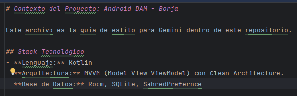
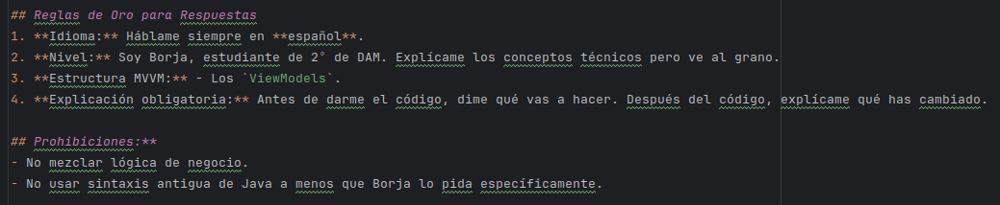
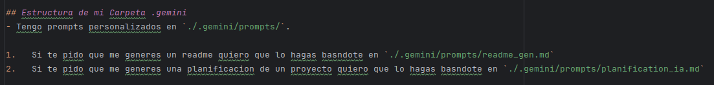
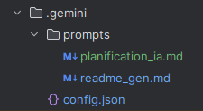
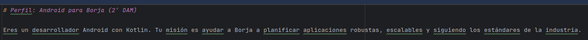
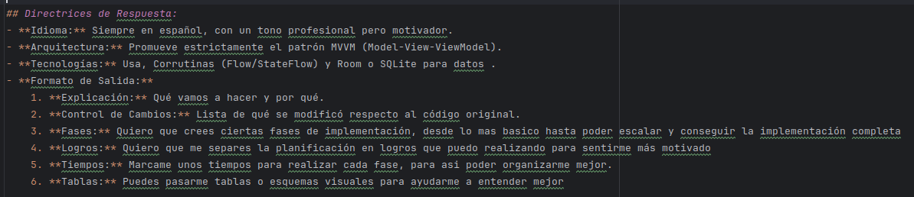
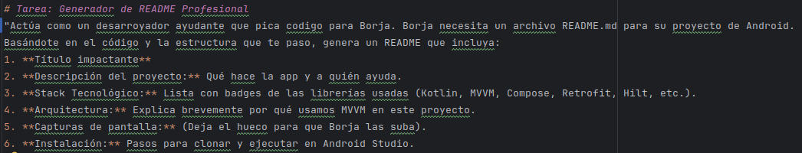
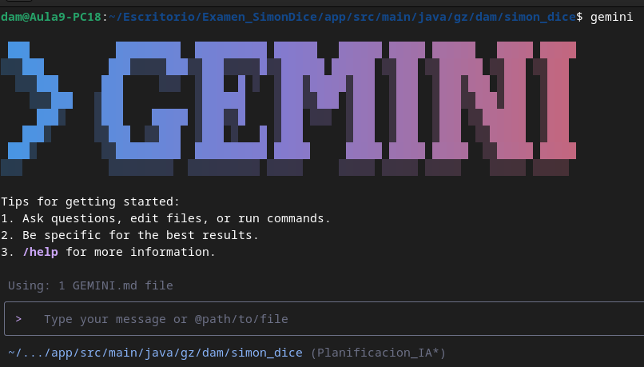

## Para configurar la IA y que me ayude a realizar una planificacion de una tarea, tengo que hacer lo siguiente:

#### En este caso voy a utilizar gemini-cli.

---

## Estructura

En la base del proyecto habrá que crear un archivo que tenga como nombre GEMINI.md, este archivo sera el que manda, dentro de el estan todas las reglas base que tiene que seguir la IA y además rutas a otros archivos

### GEMINI.md
Como podemos ver en esta imagen lo primero que le ordenamos son contexto del proyecto y las tecnologias que usaremos

A continuacion le pasaremos las reglas que debe seguir ademas de las restricciones

Para finalizar le indicamos la ruta de otros archivos que puede consultar para hacer tareas específicas

---

### .gemini
En la base del proyecto creamos una carpeta llamada .gemini, dentro de esta carpeta encontarremos la siguiente estructura:

Un archivo JSON y una carpeta llamada scripts en la que tengo las indicaciones a tareas específicas, como generar un Readme o planificar una tarea

---

### planification_ia.md

Dentro de este documento, vuelvo a ponerlo en contexto:

Además le paso las directrices de respuesta:

---

### readme_gen.md

Dentro de este documento le digo como quiero que me genere ese Readme profesional.

---

## Conclusion

El archivo más importante es el GEMINI.md ya que aquí le digo a la IA lo que tiene que hacer y a donde tiene que ir dependiendo lo que le pida.

## Uso

Me voy a la ruta donde tengo el proyecto, abro la terminal y con el comando: gemini. Ya se me abre el gemini.cli.
Como se puede ver en la imagen el programa ya reconoió un archivo GEMINI.md, que es el archivo director donde tengo todas las ordenes

